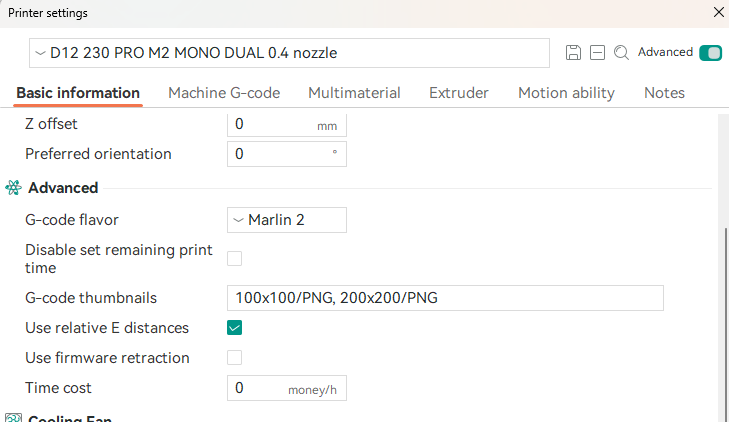

# D12 Preview TS35-R V2 Post-Processor
[](./README.md)


## Aperçu

Le post-processeur D12 Preview TS35-R V2 est conçu pour Orca Slicer et PrusaSlicer, offrant une solution complète pour générer des aperçus de modèles compatibles avec les imprimantes 3D Wanhao D12 équipées de l'écran MKS TS35-R V2.0 et d'une carte MKS Robin Nano.

### Principales caractéristiques

**Génération automatique d'images :** Convertit les miniatures dans un format compatible avec l'écran MKS TS35-R V2.0 et une carte MKS Robin Nano, les intégrant au fichier G-code pour permettre aux utilisateurs de prévisualiser les modèles 3D directement sur leurs imprimantes 3D Wanhao D12.

## Installation

1. **Téléchargez** la dernière version de **d12_preview_ts35r_v2.zip**.
2. **Décompressez** le fichier exécutable et placez-le à l'emplacement de votre choix.

## Configuration

### Orca Slicer

1. **Paramètres de l'imprimante -> Informations de base :**
   - **Flavor G-code :** `Marlin 2` (or  `Marlin`)
   - **Miniatures G-code :** `100x100/PNG, 200x200/PNG`

    

2. **Traitement -> Autres -> Scripts de post-traitement :**
   - Spécifiez le chemin de l'exécutable du post-processeur :
     ```
     "C:\Endroit\ou\vous\avez\placé\d12_preview_ts35r_v2.exe";
     ```
    

