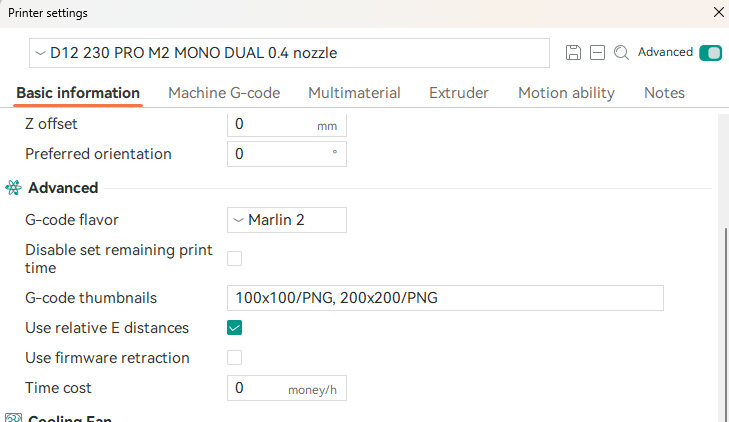
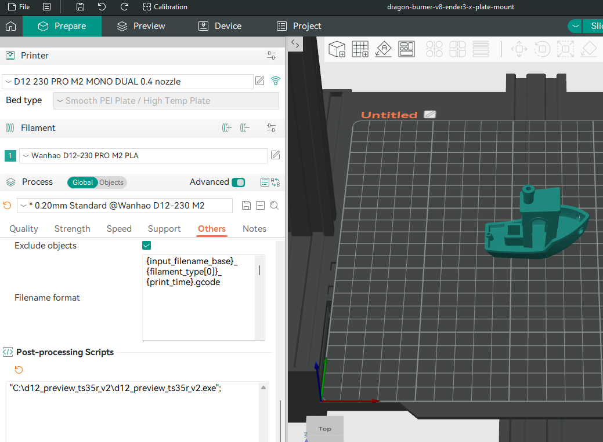

# D12 Preview TS35-R V2 Post-Processor
[](./README.fr.md)


## Overview

The D12 Preview TS35-R V2 post processor is designed for Orca Slicer and PrusaSlicer, providing a complete solution for generating model previews compatible with Wanhao D12 3D printers with MKS TS35-R V2.0 display and with mks robin nano board.

### Key Features

**Automatic Image Generation:** Converts thumbnails into a format compatible with the MKS TS35-R V2.0 display and an MKS Robin Nano board, embedding them into the G-code file to allow users to preview 3D models directly on their Wanhao D12 3D printers.

# Installation

1. **Download** the latest version of **d12_preview_ts35r_v2.zip**.
2. **Unzip** the executable file and place it in your desired location.

# Configuration

## Orca Slicer

1. **Printer Settings -> Basic Information:**
   - **G-code flavor** to `Marlin 2` (or `Marlin`)
   - **G-code thumbnails**: `100x100/PNG, 200x200/PNG`

    


2. **Process -> Others -> Post-processing Scripts:**
   - Specify the path to the post-processor executable:
     ```
     "C:\Path\Where\You\Put\d12_preview_ts35r_v2.exe";
     ```
    


